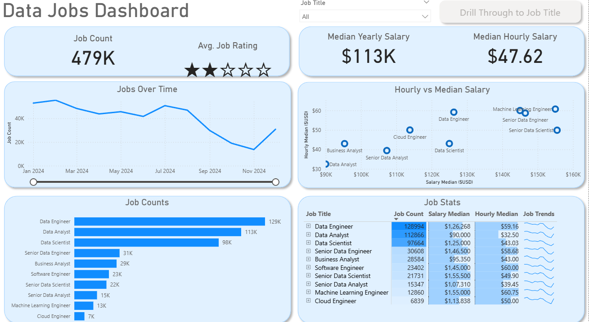
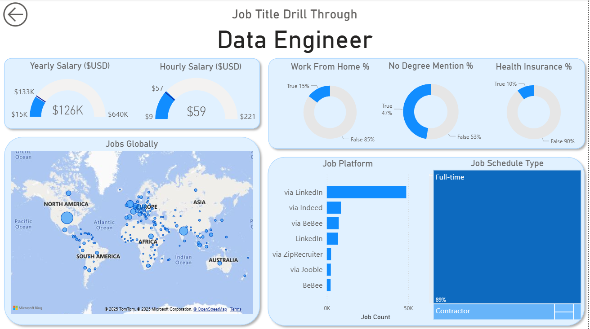

# 📊 Data Jobs Dashboard (Power BI Project)

This project is a **Power BI Dashboard** created as part of my learning journey with Power BI.  
The dashboard provides insights into the **Data Jobs Market**, including job counts, salaries, job trends, and global job distribution.

---

## 🔍 Project Overview
The **Data Jobs Dashboard** analyzes various job titles in the data domain (Data Engineer, Data Scientist, Data Analyst, etc.) and highlights key metrics such as:
- Total job postings and average job ratings  
- Median yearly and hourly salaries  
- Job counts by title  
- Trends in job postings over time  
- Salary vs. hourly pay distribution  
- Job statistics (salary, hourly rate, and trends per title)  
- Drill-through analysis for deeper insights (e.g., Data Engineer jobs globally, platforms, schedule type)

---

## 📷 Dashboard Preview
### Main Dashboard  

### Drill-Through (Data Engineer Example)  

---

## ⚙️ Features
- **Interactive Visuals**: Filter by job title and drill through for deeper insights.  
- **Salary Analysis**: Median yearly and hourly salary comparisons across roles.  
- **Job Trends**: Visualization of job postings over time.  
- **Geographic Distribution**: Jobs mapped globally by region.  
- **Job Platforms & Types**: Breakdown of where jobs are posted and schedule types.  

---

## 🛠️ Tools & Technologies
- **Power BI** for data visualization and dashboard creation  
- **Dataset**: Job postings dataset (includes job count, salaries, ratings, and platforms)  

---

## 🎯 Learning Outcome
This project helped me:
- Understand how to **build interactive dashboards** in Power BI  
- Work with **visualizations, drill-through, and slicers**  
- Analyze job market trends in the **data industry**  
- Present insights in a **clear and structured format**  

---

## 🚀 How to Use
1. Clone this repository  
2. Open the `.pbix` file in Power BI Desktop  
3. Explore the dashboards interactively  

---

## 🙏 Acknowledgments
This project was built as part of my **learning process in Power BI**.  
Special thanks to the **@lukebarousse** and resources that guided me throughout the project.  

